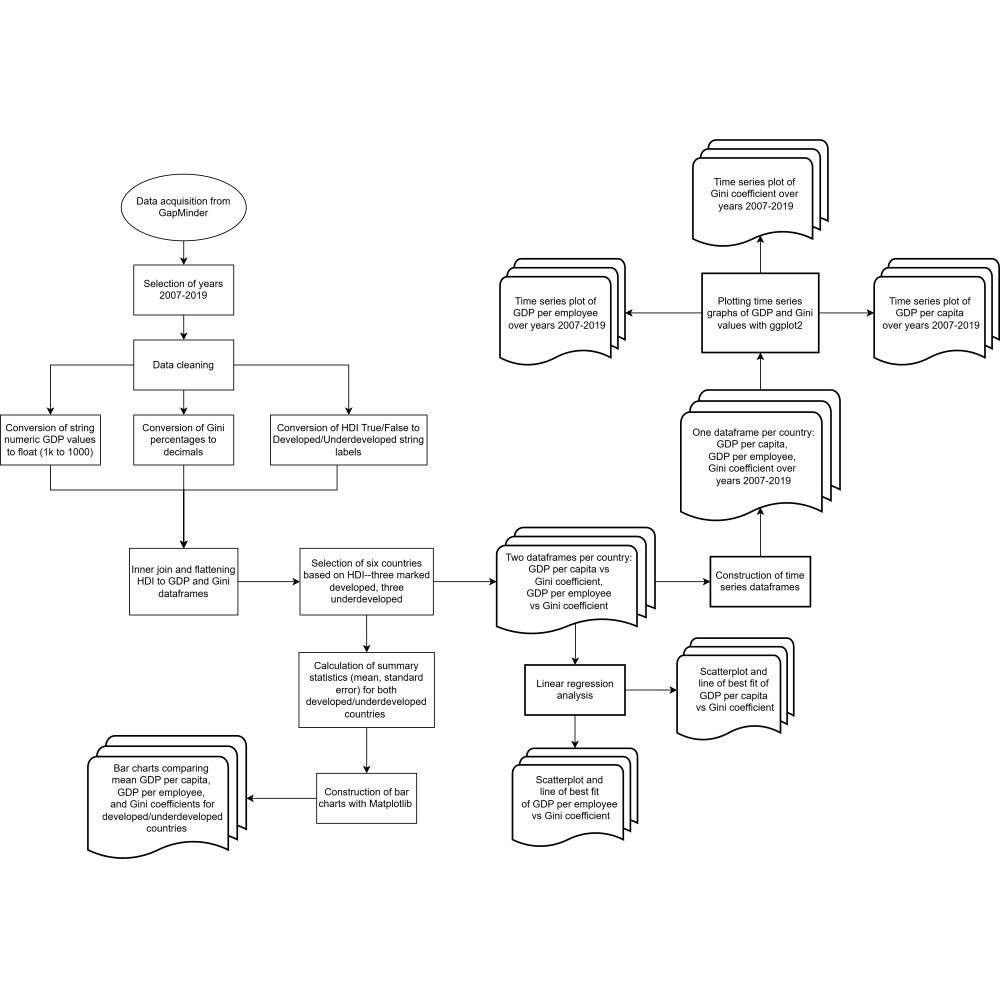

# **I. Abstract**

Measures of gross domestic product (GDP), the monetary value of goods and services produced within a country, are typically believed to be reflective of that country’s economic size and activity and somewhat indicative of its overall standard of living. A country’s GDP may be further adjusted to account for other factors: GDP per capita, for example, divides total GDP by total population and results in an average measure of economic output per person, and GDP per employee divides total GDP by the working population to estimate labor force productivity. However, economists and statisticians argue that GDP alone is not a reliable marker for standard of living, which encompasses many other aspects, such as health and education, environmental quality, leisure time, non-market activity, and income inequality. The Gini coefficient is a measure of a country’s income inequality on a 0-1 scale, where 0 represents perfect equality, where all income values are the same, and 1 represents maximum inequality, where one individual receives all the income and others have none. We wanted to explore the relationship between economic activity and income inequality for both developed and developing countries. To define “developed” and “underdeveloped”, we used the Human Development Index (HDI), which ranks countries on a 0-1 scale (0 being least developed, 1 being most developed) and takes into account life expectancy, education level, and gross national income. We chose to focus on three underdeveloped countries and three developed countries based on the “highly developed” threshold of 0.8 on the HDI from the years 2007-2019. We performed regression analysis to determine the relationship between GDP per employee, GDP per capita, and Gini coefficient data for each country; measured the change in these three variables over time to analyze the impact of historical socio-economic events such as the recession of 2008 and the onset of COVID-19; and compared mean GDP and Gini values between developed and underdeveloped cohorts. While developed countries tended to have higher GDP values, we could not determine any real relationship between development level, GDP, and income inequality; differences in income inequality between developed/underdeveloped cohorts were also much lower than expected, supporting the idea that economic growth values are not a particularly accurate measure for standard of living. We suggest that future research may focus on countries with similar HDI rankings and other social, economic, or political factors that may influence both economic activity and standard of living.

# **II. Introduction**

While standards of living are rising in many countries, income inequality continues to be a persistent issue. Many developed countries experience high living standards, but the distribution of income amongst its individuals is highly unequal. On the other hand, many developing countries experience lower living standards while also experiencing an unequal distribution of income. A common measure of standard of living is the amount of gross domestic product (GDP) per capita, or the average amount of resources and income distributed to all individuals in a country. On average, developed countries have high levels of GDP per capita and developing countries have low levels of GDP per capita, usually due to both low total GDP and high population growth rates [@imfGDP]. GDP per capita is thus an indicator of how developed a country is. However, a better measure, called the Human Development Index (HDI), considers education, knowledge levels, life expectancy, and GDP per capita. The HDI for every country is calculated as a number between 0 and 1. Most economists argue that a country is considered highly developed when its HDI is greater than 0.8 [@undpHDI].

Factoring in education levels and life expectancy allows for a broader understanding of the quality of life in a country, as most developed countries have both higher quality of education and higher life expectancy. A metric that measures total productivity of the labor force, which is also correlated with education levels, is GDP per employee or worker. Similar to GDP per capita, this measures how much output each employed person produces to contribute to growth in an economy [@undpHDI]. Thus, developed countries are likely to have a more productive workforce, as most economists argue that education has positive externalities on productivity.

Despite the clear distinction in GDP per capita and GDP per employee in developed and developing countries, some countries have improved while others may have remained stagnant or even decreased. Furthermore, while individuals on average may have high income or productivity, how can one ensure that this distribution is equal? Therefore, comparing inequality in developed and developing countries allows for more insight into this. One measure of income inequality is the Gini Coefficient. The Gini Coefficient is calculated from the Lorenz Curve, which lines up individuals from low to high income and measures what share of the population their income makes up relative to the total income in the economy. The further the Lorenz Curve is from the line of equality (which is a 45-degree line extending from the origin), the more unequal the income distribution is in an economy [@hasell2023gini]. Therefore, the Gini Coefficient is a number between 0 and 1, and a higher value corresponds to a more unequal income distribution. Most economists argue that a country has a relatively equal distribution if its Gini Coefficient is around 0.25 [@hasell2023gini]. 

Despite this, many countries, both developed and undeveloped, have Gini Coefficient values well above 0.25. For example, the United States has a high GDP per capita and thus has a high overall standard of living. despite this, its Gini Coefficient in 2019 was around 0.4 indicating that the overall distribution of income is unequal[@gapminderGini]. This could suggest that a disproportionate amount of resources are being allocated to wealthier individuals as opposed to poorer individuals. This creates the question of to what extent is GDP per capita a reliable measure of standard of living. Furthermore, the amount of inequality across all countries varies significantly less across developed and developing countries than GDP per capita amounts do.

Previous research suggests a complex interplay between living standards and inequality. Some countries may have experienced a rise in GDP per capita with a rise in income inequality or a decline in income inequality. Additionally, due to the complexity of these relationships, it is difficult for economists to determine the directionality of these relationships. Therefore, this project samples six countries (United States, Uganda, Bangladesh, Ecuador, Norway, and Australia) of differing HDI values to determine if there are differences in both directionality and strength of the relationship between GDP per capita and the Gini Coefficient. Similarly we also examine the relationship between GDP per employee and the Gini Coefficient. The dataset on GDP per capita [@worldbankGDP] comes from the World Bank, the dataset on GDP per employee [@ilostat2024] comes from the International Labor Organization (ILO), the dataset on the Gini Coefficient [@gapminderGini] comes from GapMinder, and the data set on the HDI [@undpHDI] comes from the United Nations. What we ended up discovering was that the relationships were stronger in developed countries than in developing countries based on the correlation coefficient (r) values. However, the directionality was also proven to be highly complicated. The United States, Norway, and Australia have similar HDI values; even so, the US and Norway faced an upward sloping relationship between standard of living and productivity on the Gini Coefficient, and Australia faced a downward sloping trend. Therefore, we could posit that Australia overall became more equal when its standard of living rose, potentially indicating a much higher quality of life than in Norway or the US. Examining developing countries, the relationships were also downward sloping like in Australia, though much weaker. Thus, it comes to question if high GDP per capita in Norway and the US is really indicative of a high standard of living and quality of life.

Another important area of analysis is to examine the changes in these variables over time. The time frame of our analysis is from 2007 through 2019, highlighting the onset of the Great Recession through the years leading up to the COVID-19 pandemic. What we discovered is that for all six countries, GDP per capita and GDP per employee rose, but not significantly indicating that standards of living and productivity in 2019 were similar to that in 2007. Interestingly, there were less discrepencies in the Gini Coefficient values between developed and developing countries. For example, the US had a similar Gini Coefficient to Uganda and a higher value than Bangladesh despite each of those countries having a higher HDI. This supports the previous idea that inequality is still globally prevalent.

Furthermore, we also analyzed if there were overall statistically significant differences in average GDP per capita, GDP per employee, and the Gini Coefficient in developed and developing countries by sampling all countries in our dataset. This sampling included approximately 40% developed countries and 60% undeveloped countries allowing for a robust comparison between the two. Using a 95% confidence interval, we found statistically significant differences between all variables in developed and developing countries though the differences were significantly smaller amongst the Gini Coefficient values. Finally, this suggests that in order to examine a country’s actual quality of life, it is important for economists to examine factors that go beyond GDP per capita or GDP per employee, such as income inequality.

This goes to support the idea that while a country may have a high standard of living on average, income inequality becomes more important in examining each individual’s quality of life. Future research should be geared towards sampling more countries to see if a noticeable pattern emerges when conducting regression analysis. Additionally, for policy makers in developed nations such as the US, these findings highlight the importance of addressing persistent income inequality, even amongst the rising living standards.

# **III. Methods**


```{r setup, echo=FALSE}

# Hide all code when rendering to pdf

knitr::opts_chunk$set(
  echo = FALSE,
  cache=FALSE,
  results = 'hide',
  message = FALSE,
  warning = FALSE,
  fig.align = 'center'
)

```


```{r fig.align='left', out.width='95%', fig.cap='\\textit{This diagram showcases all project steps, from obtaining data, to creating charts and plots.}'}



```


**Figure 1. This diagram showcases all project steps, from obtaining data to creating charts and plots.**

The goal of this project was to analyze the relationship between economic activity and quality of life (specifically inequality between income distributions) for both developed and underdeveloped countries. Our data for economic activity was measured in both GDP per capita (gross domestic product divided by total population) and GDP per employee (gross domestic product divided by working population). Though both are similar, GDP per capita offers a broader look at general economic prosperity, while GDP per employee is a measure of worker efficiency; analyzing both variables would give us a more complete picture of a country's economic well-being. Income inequality was measured with the Gini coefficient, which represents a country’s degree of deviation from perfect income distribution. We chose three developed and three underdeveloped countries to work with, hoping to find differences between the two.

The datasets comprised information regarding GDP per capita, GDP per employee, the Gini coefficient, and the HDI for 189 countries over the span of 29 years (1991 through 2019). Additionally, the datasets on GDP per capita and GDP per employee were measured in a common currency (the US dollar) and adjusted for inflation. Our data cleaning process began with narrowing down a range of years to analyze. We ultimately selected the period from 2007 through 2019 (which contained recently collected, relatively intact data), and we reformatted the data frames to include only information from those 13 years. 29 countries (15% of all 189 countries) were also removed from our datasets because there were too many missing values and not enough information to guarantee accurate analysis. Both GDP datasets were converted from strings to floats; furthermore, Gini coefficient values were converted from percentages to decimal values.

Initially, countries were to be sorted solely into “developed” and “developing” (or “underdeveloped”) categories based on whether they met a certain GDP threshold. Instead, we utilized the HDI because there is no current, definitive, binary standard determining whether a country was classified as “developed” or “developing." It was determined that six of the remaining 160 countries will represent each of the HDI’s four development levels (low, medium, high, and very high development), with the threshold being a 0.8 HDI[@undpHDI]. Countries greater than or equal to the threshold were labeled as “developed,” and the other countries were labeled as “undeveloped”. United States, Norway, and Australia are classified as “developed.” Uganda, Bangladesh, and Ecuador are classified as “undeveloped.” Each country would represent a different continent, and at least one country would represent each of the four levels of development. 2019, was the year we chose to determine a country's HDI. In our dataset, Norway had the highest HDI in this year.

The HDI data frame had been imported as a series of integer values. We then set the threshold to 0.8. If a country had an HDI greater than or equal to the threshold, the 2019 column was set to "true," otherwise the data point was set to "false." Finally, the boolean values were converted to string labels “developed," if true and “underdeveloped,” if false. The HDI 2019 column was inner joined with ourprevious three datasets to better visualize global economic status. The above-mentioned countries’ GDP per capita, GDP per employee, and Gini coefficient data from 2007-2019 for regression analysis were isolated and were reformatted with year labels for time series plotting. Finally, summary statistics (mean and standard error) were computed for both developed and underdeveloped cohorts and used to visualize our bar charts. Data manipulation was done with Python’s pandas and summary statistics were calculated with numpy.

Had countries with NaN values been selected, the line of best fit of each linear regression analysis would likely be unrepresentative of their respective countries. Plus, such data is necessary to ensure the completeness of annual time series graphs. Even after the first 29 countries were removed, approximately 40% of countries were classified as “developed” and 60% were labeled “undeveloped,” ensuring an approximately representative sample size.

| Country       | Continent      | HDI   | Development Level |
|---------------|----------------|-------|--------------------|
| United States | North America  | 0.930 | Very High          |
| Uganda        | Africa         | 0.522 | Low                |
| Bangladesh    | Asia           | 0.644 | Medium             |
| Ecuador       | South America  | 0.760 | High               |
| Norway        | Europe         | 0.961 | Very High          |
| Australia     | Oceania        | 0.941 | Very High          |

**Table 1. Continents, HDI, and Corresponding Development Levels for Selected Countries, as of 2019.**

We first determined the relationship between countries’ GDP values and their Gini coefficient values by conducting a linear regression analysis. A positive correlation would indicate that income inequality increased with economic activity–that is, an economy in which richer individuals become richer, while poorer individuals either stay as poor or become poorer. A negative correlation, on the other hand, suggests that income inequality would decrease with more economic activity. 

Then, we decided to create time-series graphs of all three variables to identify any historical events that might have shifted values one way or another, as well as quantify differences between countries. In addition to this being a useful tool for us to see changes in standards of living in different countries' economies, it also allowed us to visualize and quantify these differences.

Our linear regression models and time series visualizations were done using ggplot2 in R. Scatterplots of the relationship between GDP per capita and GDP per employee on the Gini coefficient for each country were color-coded for each country. Lines of best fit were drawn with the lm line-fitting function and overlaid onto the plots. The correlation coefficient for each relationship was calculated with the cor function. 

Our time series graphs were created using the geom_line function. These plots were generated for each country, in keeping with the previously established color codes. Since the gap between GDP values for developed and developing countries was so large, we opted to plot them separately, on different axes, which are scaled accordingly.

Finally, we created two bar charts to analyze the difference in mean GDP values and mean Gini coefficient values. These graphs were a direct comparison between developed/underdeveloped countries, and allowed us to look at each variable individually.

Bar plots for each country were plotted using Python’s Matplotlib, and our previously calculated summary statistics (mean and standard error for GDP per capita, GDP per employee, and Gini coefficient for developed and underdeveloped countries). We used the standard error to generate the confidence interval, rather than the standard deviation. This was because we had to drop certain countries with missing values, and thus were using a sample of the dataset. Confidence intervals for each variable were calculated by multiplying the standard error by 2. For clarity, GDP values were plotted together on one set of axes (Figure 6a.), while Gini Coefficient values were plotted on a different set of axes (Figure 6b.).

# **IV. Results**


```{python}

# Load in the Python libraries to be used
import numpy as np
import pandas as pd
import matplotlib.pyplot as plt

```


```{python}

# Load in the data sets
gdp_per_capita = pd.read_csv('gdppercapita_us_inflation_adjusted.csv')
gdp_per_employee = pd.read_excel('gdpperemployee_us_inflation_adjusted.xlsx')
gini = pd.read_csv('gini.csv')
hdi = pd.read_csv('hdi_human_development_index.csv')

```


```{python}

# Cleaning data set on GDP per employee

# Keeps only the non-year columns and year columns between 2007 and 2019
filtered_gdp_per_employee = pd.concat(
  [gdp_per_employee.loc[:, :'country'], 
  gdp_per_employee.loc[:, 2007:2019]], axis=1
  )
  
type(filtered_gdp_per_employee.loc[2, 2007]) # Without k, type is int
type(filtered_gdp_per_employee.loc[3, 2007]) # With k, type is string

# Checks if string and contains k, removes the k, converts to float, and multiplies by 1000
def removeK(df):
  if type(df) == str and 'k' in df:
    return float(df.replace('k', '')) * 1000
  return float(df)

# List of years in ints in data frame
col = [2007, 2008, 2009, 2010, 2011, 2012, 2013, 2014, 2015, 2016, 2017, 2018, 2019]

# Loops through each year applying the removeK function on each year
for i in col:
  filtered_gdp_per_employee[i] = filtered_gdp_per_employee[i].apply(removeK)

type(filtered_gdp_per_employee.loc[2, 2007]) # Now a float
type(filtered_gdp_per_employee.loc[3, 2019]) # Also a float

```


```{python}

# Cleaning data set on GDP per capita

# Keeps only the non-year columns and year columns between 2007 and 2019
filtered_gdp_per_capita = pd.concat(
  [gdp_per_capita.loc[:, :'country'], 
  gdp_per_capita.loc[:, '2007':'2019']], axis=1
  ).dropna()
 
# list of years in strings 
col = ['2007', '2008', '2009', '2010', '2011', '2012', '2013', '2014', '2015', '2016', '2017', '2018', '2019']

# Loops through each year applying the removeK function on each year
for i in col:
  filtered_gdp_per_capita[i] = filtered_gdp_per_capita[i].apply(removeK)

```


```{python}

# Cleaning data set on Gini Coefficient

filtered_gini = pd.concat(
  [gini.loc[:, :'country'], 
  gini.loc[:, '2007':'2019']], axis=1
  )

col = ['2007', '2008', '2009', '2010', '2011', '2012', '2013', '2014', '2015', '2016', '2017', '2018', '2019']

# Converted gini coefficient values from percentages to decimal form
for i in col:
  filtered_gini[i] = filtered_gini[i] / 100

```


```{python}

# Cleaning Human Development Index Dataset

# Keeps only the non-year columns and year columns between 2007 and 2019
filtered_hdi = pd.concat(
  [hdi.loc[:, :'country'], 
  hdi.loc[:, '2007':'2019']], axis=1
  ).dropna()
  
# Add column that states whether country is developed (> 0.8) or undeveloped (< 0.8)
filtered_hdi['Type'] = filtered_hdi['2019']
filtered_hdi['Type'] = filtered_hdi['Type'] > 0.8
filtered_hdi['Type'] = filtered_hdi['Type'].replace({True: 'developed', False: 'undeveloped'})

Type = filtered_hdi['Type'].to_frame()
Country = filtered_hdi['country'].to_frame()
filtered_hdi = pd.concat([Country, Type], axis = 1)

```


```{python}

# Inner join the Type column of HDI dataset with the other three datasets

filtered_gdp_per_capita = pd.merge(filtered_gdp_per_capita, filtered_hdi, on='country', how='inner')

# Dropped NaN in GDP Per Capita Dataset for 29 Countries (13% of dataset)
# Approximately a 40-60 split between developed and undeveloped countries
percentage_developed_cap = (filtered_gdp_per_capita['Type'].value_counts(normalize=True).get('developed', 0)) * 100
percentage_undeveloped_cap = (filtered_gdp_per_capita['Type'].value_counts(normalize=True).get('undeveloped', 0)) * 100

# Approximately a 40-60 split between developed and undeveloped countries
filtered_gdp_per_employee = pd.merge(filtered_gdp_per_employee, filtered_hdi, on='country', how='inner')
percentage_developed_emp = (filtered_gdp_per_employee['Type'].value_counts(normalize=True).get('developed', 0)) * 100
percentage_undeveloped_emp = (filtered_gdp_per_employee['Type'].value_counts(normalize=True).get('undeveloped', 0)) * 100

# Approximately a 40-60 split between developed and undeveloped countries
filtered_gini = pd.merge(filtered_gini, filtered_hdi, on='country', how='inner')
percentage_developed_gini = (filtered_gini['Type'].value_counts(normalize=True).get('developed', 0)) * 100
percentage_undeveloped_gini = (filtered_gini['Type'].value_counts(normalize=True).get('undeveloped', 0)) * 100

```


```{python}

# Final cleaning for regression between GDP Per Capita and Gini Coefficient

# United States
USA_cap = (filtered_gdp_per_capita[filtered_gdp_per_capita['country'] == 'USA'].iloc[:, 1:-1]).to_numpy().ravel()
USA_gini = (filtered_gini[filtered_gini['country'] == 'USA'].iloc[:, 1:-1]).to_numpy().ravel()

USA_df = pd.DataFrame({'X-axis': USA_cap, 'Y-axis': USA_gini})

# Uganda
Uganda_cap = (filtered_gdp_per_capita[filtered_gdp_per_capita['country'] == 'Uganda'].iloc[:, 1:-1]).to_numpy().ravel()
Uganda_gini = (filtered_gini[filtered_gini['country'] == 'Uganda'].iloc[:, 1:-1]).to_numpy().ravel()

Uganda_df = pd.DataFrame({'X-axis': Uganda_cap, 'Y-axis': Uganda_gini})

# Bangladesh
Bangladesh_cap = (filtered_gdp_per_capita[filtered_gdp_per_capita['country'] == 'Bangladesh'].iloc[:, 1:-1]).to_numpy().ravel()
Bangladesh_gini = (filtered_gini[filtered_gini['country'] == 'Bangladesh'].iloc[:, 1:-1]).to_numpy().ravel()

Bangladesh_df = pd.DataFrame({'X-axis': Bangladesh_cap, 'Y-axis': Bangladesh_gini})

# Ecuador
Ecuador_cap = (filtered_gdp_per_capita[filtered_gdp_per_capita['country'] == 'Ecuador'].iloc[:, 1:-1]).to_numpy().ravel()
Ecuador_gini = (filtered_gini[filtered_gini['country'] == 'Ecuador'].iloc[:, 1:-1]).to_numpy().ravel()

Ecuador_df = pd.DataFrame({'X-axis': Ecuador_cap, 'Y-axis': Ecuador_gini})

# Norway
Norway_cap = (filtered_gdp_per_capita[filtered_gdp_per_capita['country'] == 'Norway'].iloc[:, 1:-1]).to_numpy().ravel()
Norway_gini = (filtered_gini[filtered_gini['country'] == 'Norway'].iloc[:, 1:-1]).to_numpy().ravel()

Norway_df = pd.DataFrame({'X-axis': Norway_cap, 'Y-axis': Norway_gini})

# Australia
Australia_cap = (filtered_gdp_per_capita[filtered_gdp_per_capita['country'] == 'Australia'].iloc[:, 1:-1]).to_numpy().ravel()
Australia_gini = (filtered_gini[filtered_gini['country'] == 'Australia'].iloc[:, 1:-1]).to_numpy().ravel()

Australia_df = pd.DataFrame({'X-axis': Australia_cap, 'Y-axis': Australia_gini})

```


```{python}

# Final cleaning for regression between GDP Per Employee and Gini Coefficient

# United States
USA_emp = (filtered_gdp_per_employee[filtered_gdp_per_employee['country'] == 'USA'].iloc[:, 1:-1]).to_numpy().ravel()

USA_df_per_emp = pd.DataFrame({'X-axis': USA_emp, 'Y-axis': USA_gini})

# Uganda
Uganda_emp = (filtered_gdp_per_employee[filtered_gdp_per_employee['country'] == 'Uganda'].iloc[:, 1:-1]).to_numpy().ravel()

Uganda_df_per_emp = pd.DataFrame({'X-axis': Uganda_emp, 'Y-axis': Uganda_gini})

# Bangladesh
Bangladesh_emp = (filtered_gdp_per_employee[filtered_gdp_per_employee['country'] == 'Bangladesh'].iloc[:, 1:-1]).to_numpy().ravel()

Bangladesh_df_per_emp = pd.DataFrame({'X-axis': Bangladesh_emp, 'Y-axis': Bangladesh_gini})

# Ecuador
Ecuador_emp = (filtered_gdp_per_employee[filtered_gdp_per_employee['country'] == 'Ecuador'].iloc[:, 1:-1]).to_numpy().ravel()

Ecuador_df_per_emp = pd.DataFrame({'X-axis': Ecuador_emp, 'Y-axis': Ecuador_gini})

# Norway
Norway_emp = (filtered_gdp_per_employee[filtered_gdp_per_employee['country'] == 'Norway'].iloc[:, 1:-1]).to_numpy().ravel()

Norway_df_per_emp = pd.DataFrame({'X-axis': Norway_emp, 'Y-axis': Norway_gini})

# Australia
Australia_emp = (filtered_gdp_per_employee[filtered_gdp_per_employee['country'] == 'Australia'].iloc[:, 1:-1]).to_numpy().ravel()

Australia_df_per_emp = pd.DataFrame({'X-axis': Australia_emp, 'Y-axis': Australia_gini})

```


```{python}

# Final cleaning for timeseries showcasing GDP Per Capita, GDP Per Employee, and Gini Coefficient

# United States
USA_timeseries_df=pd.DataFrame({'Year':col,'GDP per Capita':USA_cap,'GDP per Employee':USA_emp,'Gini Coefficient': USA_gini})

# Uganda
Uganda_timeseries_df=pd.DataFrame({'Year':col,'GDP per Capita':Uganda_cap,'GDP per Employee':Uganda_emp,'Gini Coefficient': Uganda_gini})

# Bangladesh
Bangladesh_timeseries_df=pd.DataFrame({'Year':col,'GDP per Capita':Bangladesh_cap,'GDP per Employee':Bangladesh_emp,'Gini Coefficient': Bangladesh_gini})

# Ecuador
Ecuador_timeseries_df=pd.DataFrame({'Year':col,'GDP per Capita':Ecuador_cap,'GDP per Employee':Ecuador_emp,'Gini Coefficient': Ecuador_gini})

# Norway
Norway_timeseries_df=pd.DataFrame({'Year':col,'GDP per Capita':Norway_cap,'GDP per Employee':Norway_emp,'Gini Coefficient': Norway_gini})

# Australia
Australia_timeseries_df=pd.DataFrame({'Year':col,'GDP per Capita':Australia_cap,'GDP per Employee':Australia_emp,'Gini Coefficient': Australia_gini})

```


```{python}

# Final cleaning for bar charts showing the three variables in developed and developing countries

# GDP Per Capita
filtered_gdp_per_cap_dev = filtered_gdp_per_capita[filtered_gdp_per_capita['Type'] == 'developed']
filtered_gdp_per_cap_un = filtered_gdp_per_capita[filtered_gdp_per_capita['Type'] == 'undeveloped']

# GDP Per Employee
filtered_gdp_per_emp_dev = filtered_gdp_per_employee[filtered_gdp_per_employee['Type'] == 'developed']
filtered_gdp_per_emp_un = filtered_gdp_per_employee[filtered_gdp_per_employee['Type'] == 'undeveloped']

# Gini Coefficient
filtered_gini_dev = filtered_gini[filtered_gini['Type'] == 'developed']
filtered_gini_un = filtered_gini[filtered_gini['Type'] == 'undeveloped']

```


```{python}

# Summary statistics (Mean and Standard Error of the Mean) to be used in each bar chart
# Standard error will later be used to determine the 95% confidence interval

# GDP Per Capita
mean_dev_gdp_per_cap = filtered_gdp_per_cap_dev['2019'].mean()
se_dev_gdp_per_cap = np.std(filtered_gdp_per_cap_dev['2019'], ddof = 1) / np.sqrt(len(filtered_gdp_per_cap_dev))

mean_un_gdp_per_cap = filtered_gdp_per_cap_un['2019'].mean()
se_un_gdp_per_cap = np.std(filtered_gdp_per_cap_un['2019'], ddof = 1) / np.sqrt(len(filtered_gdp_per_cap_un))

# GDP Per Employee
mean_dev_gdp_per_emp = filtered_gdp_per_emp_dev[2019].mean()
se_dev_gdp_per_emp = np.std(filtered_gdp_per_emp_dev[2019], ddof = 1) / np.sqrt(len(filtered_gdp_per_emp_dev))

mean_un_gdp_per_emp = filtered_gdp_per_emp_un[2019].mean()
se_un_gdp_per_emp = np.std(filtered_gdp_per_emp_un[2019], ddof = 1) / np.sqrt(len(filtered_gdp_per_emp_un))

# Gini Coefficient
mean_dev_gini = filtered_gini_dev['2019'].mean()
se_dev_gini = np.std(filtered_gini_dev['2019'], ddof = 1) / np.sqrt(len(filtered_gini_dev))

mean_un_gini = filtered_gini_un['2019'].mean()
se_un_gini = np.std(filtered_gini_un['2019'], ddof = 1) / np.sqrt(len(filtered_gini_un))

```


```{python}

# Save all cleaned data frames to csv files

filtered_gdp_per_capita.to_csv('filtered_gdp_per_capita.csv', index = False)
filtered_gdp_per_employee.to_csv('filtered_gdp_per_employee.csv', index = False)
filtered_gini.to_csv('filtered_gini.csv', index = False)
filtered_hdi.to_csv('filtered_hdi.csv', index = False)

# United States
USA_df.to_csv('USA_df_regression.csv')
USA_df_per_emp.to_csv('USA_df_per_emp.csv')
USA_timeseries_df.to_csv('USA_timeseries.csv')

# Uganda
Uganda_df.to_csv('Uganda_df_regression.csv')
Uganda_df_per_emp.to_csv('Uganda_df_per_emp.csv')
Uganda_timeseries_df.to_csv('Uganda_timeseries.csv')

# Bangladesh
Bangladesh_df.to_csv('Bangladesh_df_regression.csv')
Bangladesh_df_per_emp.to_csv('Bangladesh_df_per_emp.csv')
Bangladesh_timeseries_df.to_csv('Bangladesh_timeseries.csv')

# Ecuador
Ecuador_df.to_csv('Ecuador_df_regression.csv')
Ecuador_df_per_emp.to_csv('Ecuador_df_per_emp.csv')
Ecuador_timeseries_df.to_csv('Ecuador_timeseries.csv')

# Norway
Norway_df.to_csv('Norway_df_regression.csv')
Norway_df_per_emp.to_csv('Norway_df_per_emp.csv')
Norway_timeseries_df.to_csv('Norway_timeseries.csv')

# Australia
Australia_df.to_csv('Australia_df_regression.csv')
Australia_df_per_emp.to_csv('Australia_df_per_emp.csv')
Australia_timeseries_df.to_csv('Australia_timeseries.csv')

```


```{r}

# Load in the R libraries to be used
library(dplyr)
library(ggplot2)
library(patchwork)
library(magick)
library(grid)
library(gridExtra)
library(scales)
library(png)
library(magick)
```


```{r}

# Read CSV file
filtered_gdp_per_capita <- read.csv('filtered_gdp_per_capita.csv', check.names = TRUE)

# Get current column names
current_names <- colnames(filtered_gdp_per_capita)

# Remove 'X' prefix only for names that are numbers (years)
new_names <- ifelse(grepl("^X[0-9]+$", current_names), 
                    as.character(as.integer(sub("^X", "", current_names))), 
                    current_names)

# Assign the cleaned column names back to the data frame
colnames(filtered_gdp_per_capita) <- new_names

```


```{r}

# Read CSV file
filtered_gdp_per_employee <- read.csv('filtered_gdp_per_employee.csv', check.names = TRUE)

# Get current column names
current_names <- colnames(filtered_gdp_per_employee)

# Remove 'X' prefix only for names that are numbers (years)
new_names <- ifelse(grepl("^X[0-9]+$", current_names), 
                    as.character(as.integer(sub("^X", "", current_names))), 
                    current_names)

# Assign the cleaned column names back to the data frame
colnames(filtered_gdp_per_employee) <- new_names

```


```{r}

# Read CSV file
filtered_gini <- read.csv('filtered_gini.csv', check.names = TRUE)

# Get current column names
current_names <- colnames(filtered_gini)

# Remove 'X' prefix only for names that are numbers (years)
new_names <- ifelse(grepl("^X[0-9]+$", current_names), 
                    as.character(as.integer(sub("^X", "", current_names))), 
                    current_names)

# Assign the cleaned column names back to the data frame
colnames(filtered_gini) <- new_names

```


```{r, fig.align='left', out.width='80%', fig.cap="\\textit{This diagram showcases all project steps, from obtaining data, to creating charts and plots.}"}


```


```{r}

# United States
USA_df_regression <- read.csv('USA_df_regression.csv')

# Linear regression scatter plot of GDP Per Capita and Gini Coefficient in the US
model <- lm(Y.axis ~ X.axis, data=USA_df_regression)

# Calculate the correlation coefficient 'r'
r <- cor(USA_df_regression$X.axis, USA_df_regression$Y.axis)

# Calculate appropriate limits for x and y axes
x_margin <- (max(USA_df_regression$X.axis) - min(USA_df_regression$X.axis)) * 0.1
y_margin <- (max(USA_df_regression$Y.axis) - min(USA_df_regression$Y.axis)) * 0.1

# Plot the graph with best fit line
plot1 = ggplot(USA_df_regression, aes(x= X.axis, y= Y.axis)) + 
  geom_point(color="blue") +
  geom_smooth(method="lm", se=FALSE, color="grey") +
  labs(title="United States (HDI = 0.93)", x="GDP Per Capita ($/individual)", y="Gini Coefficient") +
  
  # Add a box to show the correlation coefficient
  annotate("text", x = max(USA_df_regression$X.axis) - x_margin, 
           y = max(USA_df_regression$Y.axis) - 5 * y_margin,
           label = paste("r =", round(r, 2)),
           color = "black", size = 5, hjust = 0.5, vjust = 0.5) +
  
  # Customize the theme to center the title and scale axes appropriately
  theme_minimal() +
  theme(
    plot.title = element_text(hjust = 0.5, size = 16, face = "bold"),
    axis.title.x = element_text(size = 12),
    axis.title.y = element_text(size = 12),
    legend.position = "none"
  ) +
  
  # Adjust axis limits to add space
  xlim(min(USA_df_regression$X.axis) - x_margin, max(USA_df_regression$X.axis) + x_margin) +
  ylim(min(USA_df_regression$Y.axis) - y_margin, max(USA_df_regression$Y.axis) + y_margin)

```


```{r}

# Uganda
Uganda_df_regression <- read.csv('Uganda_df_regression.csv')

# Linear regression scatter plot of GDP Per Capita and Gini Coefficient in the Uganda
model <- lm(Y.axis ~ X.axis, data=Uganda_df_regression)

# Calculate the correlation coefficient 'r'
r <- cor(Uganda_df_regression$X.axis, Uganda_df_regression$Y.axis)

# Calculate appropriate limits for x and y axes
x_margin <- (max(Uganda_df_regression$X.axis) - min(Uganda_df_regression$X.axis)) * 0.1
y_margin <- (max(Uganda_df_regression$Y.axis) - min(Uganda_df_regression$Y.axis)) * 0.1

# Plot the graph with best fit line
plot3 = ggplot(Uganda_df_regression, aes(x= X.axis, y= Y.axis)) + 
  geom_point(color="orange") +
  geom_smooth(method="lm", se=FALSE, color="grey") +
  labs(title="Uganda (HDI = 0.522)", x="GDP Per Capita ($/individual)", y="Gini Coefficient") +
  
  # Add a box with the correlation coefficient
  annotate("text", x = max(Uganda_df_regression$X.axis) - x_margin, 
           y = max(Uganda_df_regression$Y.axis) - y_margin,
           label = paste("r =", round(r, 2)),
           color = "black", size = 5, hjust = 0.5, vjust = 0.5) +
  
  # Customize the theme to center the title and scale axes appropriately
  theme_minimal() +
  theme(
    plot.title = element_text(hjust = 0.5, size = 16, face = "bold"),
    axis.title.x = element_text(size = 12),
    axis.title.y = element_text(size = 12),
    legend.position = "none"
  ) +
  
  # Adjust axis limits to add space
  xlim(min(Uganda_df_regression$X.axis) - x_margin, max(Uganda_df_regression$X.axis) + x_margin) +
  ylim(min(Uganda_df_regression$Y.axis) - y_margin, max(Uganda_df_regression$Y.axis) + y_margin)

```


```{r}

# Bangladesh
Bangladesh_df_regression <- read.csv('Bangladesh_df_regression.csv')

# Linear regression scatter plot of GDP Per Capita and Gini Coefficient in the Bangladesh
model <- lm(Y.axis ~ X.axis, data=Bangladesh_df_regression)

# Calculate the correlation coefficient 'r'
r <- cor(Bangladesh_df_regression$X.axis, Bangladesh_df_regression$Y.axis)

# Calculate appropriate limits for x and y axes
x_margin <- (max(Bangladesh_df_regression$X.axis) - min(Bangladesh_df_regression$X.axis)) * 0.1
y_margin <- (max(Bangladesh_df_regression$Y.axis) - min(Bangladesh_df_regression$Y.axis)) * 0.1

# Plot the graph with best fit line
plot5 = ggplot(Bangladesh_df_regression, aes(x= X.axis, y= Y.axis)) + 
  geom_point(color="red") +
  geom_smooth(method="lm", se=FALSE, color="grey") +
  labs(title="Bangladesh (HDI = 0.644)", x="GDP Per Capita ($/individual)", y="Gini Coefficient") +
  
  # Add a box with the correlation coefficient
  annotate("text", x = max(Bangladesh_df_regression$X.axis) - x_margin, 
           y = max(Bangladesh_df_regression$Y.axis) - y_margin,
           label = paste("r =", round(r, 2)),
           color = "black", size = 5, hjust = 0.5, vjust = 0.5) +
  
  # Customize the theme to center the title and scale axes appropriately
  theme_minimal() +
  theme(
    plot.title = element_text(hjust = 0.5, size = 16, face = "bold"),
    axis.title.x = element_text(size = 12),
    axis.title.y = element_text(size = 12),
    legend.position = "none"
  ) +
  
  # Adjust axis limits to add space
  xlim(min(Bangladesh_df_regression$X.axis) - x_margin, max(Bangladesh_df_regression$X.axis) + x_margin) +
  ylim(min(Bangladesh_df_regression$Y.axis) - y_margin, max(Bangladesh_df_regression$Y.axis) + y_margin)

```


```{r}

# Ecuador
Ecuador_df_regression <- read.csv('Ecuador_df_regression.csv')

# Linear regression scatter plot of GDP Per Capita and Gini Coefficient in the Ecuador
model <- lm(Y.axis ~ X.axis, data=Ecuador_df_regression)

# Calculate the correlation coefficient 'r'
r <- cor(Ecuador_df_regression$X.axis, Ecuador_df_regression$Y.axis)

# Calculate appropriate limits for x and y axes
x_margin <- (max(Ecuador_df_regression$X.axis) - min(Ecuador_df_regression$X.axis)) * 0.1
y_margin <- (max(Ecuador_df_regression$Y.axis) - min(Ecuador_df_regression$Y.axis)) * 0.1

# Plot the graph with best fit line
plot7 = ggplot(Ecuador_df_regression, aes(x= X.axis, y= Y.axis)) + 
  geom_point(color="purple") +
  geom_smooth(method="lm", se=FALSE, color="grey") +
  labs(title="Ecuador (HDI = 0.76)", x="GDP Per Capita ($/individual)", y="Gini Coefficient") +
  
  # Add a box with the correlation coefficient
  annotate("text", x = max(Ecuador_df_regression$X.axis) - x_margin, 
           y = max(Ecuador_df_regression$Y.axis) - y_margin,
           label = paste("r =", round(r, 2)),
           color = "black", size = 5, hjust = 0.5, vjust = 0.5) +
  
  # Customize the theme to center the title and scale axes appropriately
  theme_minimal() +
  theme(
    plot.title = element_text(hjust = 0.5, size = 16, face = "bold"),
    axis.title.x = element_text(size = 12),
    axis.title.y = element_text(size = 12),
    legend.position = "none"
  ) +
  
  # Adjust axis limits to add space
  xlim(min(Ecuador_df_regression$X.axis) - x_margin, max(Ecuador_df_regression$X.axis) + x_margin) +
  ylim(min(Ecuador_df_regression$Y.axis) - y_margin, max(Ecuador_df_regression$Y.axis) + y_margin)

```


```{r}

# Norway
Norway_df_regression <- read.csv('Norway_df_regression.csv')

# Linear regression scatter plot of GDP Per Capita and Gini Coefficient in the Norway
model <- lm(Y.axis ~ X.axis, data=Norway_df_regression)

# Calculate the correlation coefficient 'r'
r <- cor(Norway_df_regression$X.axis, Norway_df_regression$Y.axis)

# Calculate appropriate limits for x and y axes
x_margin <- (max(Norway_df_regression$X.axis) - min(Norway_df_regression$X.axis)) * 0.1
y_margin <- (max(Norway_df_regression$Y.axis) - min(Norway_df_regression$Y.axis)) * 0.1

# Plot the graph with best fit line
plot9 = ggplot(Norway_df_regression, aes(x= X.axis, y= Y.axis)) + 
  geom_point(color="brown") +
  geom_smooth(method="lm", se=FALSE, color="grey") +
  labs(title="Norway (HDI = 0.961)", x="GDP Per Capita ($/individual)", y="Gini Coefficient") +
  
  # Add a box with the correlation coefficient
  annotate("text", x = max(Norway_df_regression$X.axis) - x_margin, 
           y = max(Norway_df_regression$Y.axis) - 8 * y_margin,
           label = paste("r =", round(r, 2)),
           color = "black", size = 5, hjust = 0.5, vjust = 0.5) +
  
  # Customize the theme to center the title and scale axes appropriately
  theme_minimal() +
  theme(
    plot.title = element_text(hjust = 0.5, size = 16, face = "bold"),
    axis.title.x = element_text(size = 12),
    axis.title.y = element_text(size = 12),
    legend.position = "none"
  ) +
  
  # Adjust axis limits to add space
  xlim(min(Norway_df_regression$X.axis) - x_margin, max(Norway_df_regression$X.axis) + x_margin) +
  ylim(min(Norway_df_regression$Y.axis) - y_margin, max(Norway_df_regression$Y.axis) + y_margin)

```


```{r}

# Australia
Australia_df_regression <- read.csv('Australia_df_regression.csv')

# Linear regression scatter plot of GDP Per Capita and Gini Coefficient in the Australia
model <- lm(Y.axis ~ X.axis, data=Australia_df_regression)

# Calculate the correlation coefficient 'r'
r <- cor(Australia_df_regression$X.axis, Australia_df_regression$Y.axis)

# Calculate appropriate limits for x and y axes
x_margin <- (max(Australia_df_regression$X.axis) - min(Australia_df_regression$X.axis)) * 0.1
y_margin <- (max(Australia_df_regression$Y.axis) - min(Australia_df_regression$Y.axis)) * 0.1

# Plot the graph with best fit line
plot11 = ggplot(Australia_df_regression, aes(x= X.axis, y= Y.axis)) + 
  geom_point(color="magenta") +
  geom_smooth(method="lm", se=FALSE, color="grey") +
  labs(title="Australia (HDI = 0.941)", x="GDP Per Capita ($/individual)", y="Gini Coefficient") +
  
  # Add a box with the correlation coefficient
  annotate("text", x = max(Australia_df_regression$X.axis) - x_margin, 
           y = max(Australia_df_regression$Y.axis) - y_margin,
           label = paste("r =", round(r, 2)),
           color = "black", size = 5, hjust = 0.5, vjust = 0.5) +
  
  # Customize the theme to center the title and scale axes appropriately
  theme_minimal() +
  theme(
    plot.title = element_text(hjust = 0.5, size = 16, face = "bold"),
    axis.title.x = element_text(size = 12),
    axis.title.y = element_text(size = 12),
    legend.position = "none"
  ) +
  
  # Adjust axis limits to add space
  xlim(min(Australia_df_regression$X.axis) - x_margin, max(Australia_df_regression$X.axis) + x_margin) +
  ylim(min(Australia_df_regression$Y.axis) - y_margin, max(Australia_df_regression$Y.axis) + y_margin)

```


```{r}

# United States
USA_df_per_emp <- read.csv('USA_df_per_emp.csv')

# Linear regression scatter plot of GDP Per Employee and Gini Coefficient in the US
model <- lm(Y.axis ~ X.axis, data=USA_df_per_emp)

# Calculate the correlation coefficient 'r'
r <- cor(USA_df_per_emp$X.axis, USA_df_per_emp$Y.axis)

# Calculate appropriate limits for x and y axes
x_margin <- (max(USA_df_per_emp$X.axis) - min(USA_df_per_emp$X.axis)) * 0.1
y_margin <- (max(USA_df_per_emp$Y.axis) - min(USA_df_per_emp$Y.axis)) * 0.1

# Plot the graph with best fit line
plot2 = ggplot(USA_df_per_emp, aes(x= X.axis, y= Y.axis)) + 
  geom_point(color = 'blue') +
  geom_smooth(method="lm", se=FALSE, color="grey") +
  labs(title="United States", x="GDP Per Employee ($/worker)", y="Gini Coefficient") +
  
  # Add a box with the correlation coefficient 'r'
  annotate("text", x = max(USA_df_per_emp$X.axis) - x_margin, 
           y = max(USA_df_per_emp$Y.axis) - 5 * y_margin,
           label = paste("r =", round(r, 2)),
           color = "black", size = 5, hjust = 0.5, vjust = 0.5) +
  
  # Customize the theme to center the title and scale axes appropriately
  theme_minimal() +
  theme(
    plot.title = element_text(hjust = 0.5, size = 16, face = "bold"),
    axis.title.x = element_text(size = 12),
    axis.title.y = element_text(size = 12),
    legend.position = "none"
  ) +
  
  # Adjust axis limits to add space
  xlim(min(USA_df_per_emp$X.axis) - x_margin, max(USA_df_per_emp$X.axis) + x_margin) +
  ylim(min(USA_df_per_emp$Y.axis) - y_margin, max(USA_df_per_emp$Y.axis) + y_margin)

```


```{r}

# Uganda
Uganda_df_per_emp <- read.csv('Uganda_df_per_emp.csv')

# Linear regression scatter plot of GDP Per Employee and Gini Coefficient in the Uganda
model <- lm(Y.axis ~ X.axis, data=Uganda_df_per_emp)

# Calculate the correlation coefficient 'r'
r <- cor(Uganda_df_per_emp$X.axis, Uganda_df_per_emp$Y.axis)

# Calculate appropriate limits for x and y axes
x_margin <- (max(Uganda_df_per_emp$X.axis) - min(Uganda_df_per_emp$X.axis)) * 0.1
y_margin <- (max(Uganda_df_per_emp$Y.axis) - min(Uganda_df_per_emp$Y.axis)) * 0.1

# Plot the graph with best fit line
plot4 = ggplot(Uganda_df_per_emp, aes(x= X.axis, y= Y.axis)) + 
  geom_point(color = 'orange') +
  geom_smooth(method="lm", se=FALSE, color="grey") +
  labs(title="Uganda", x="GDP Per Employee ($/worker)", y="Gini Coefficient") +
  
  # Add a box with the correlation coefficient
  annotate("text", x = max(Uganda_df_per_emp$X.axis) - x_margin, 
           y = max(Uganda_df_per_emp$Y.axis) - y_margin,
           label = paste("r =", round(r, 2)),
           color = "black", size = 5, hjust = 0.5, vjust = 0.5) +
  
  # Customize the theme to center the title and scale axes appropriately
  theme_minimal() +
  theme(
    plot.title = element_text(hjust = 0.5, size = 16, face = "bold"),
    axis.title.x = element_text(size = 12),
    axis.title.y = element_text(size = 12),
    legend.position = "none"
  ) +
  
  # Adjust axis limits to add space
  xlim(min(Uganda_df_per_emp$X.axis) - x_margin, max(Uganda_df_per_emp$X.axis) + x_margin) +
  ylim(min(Uganda_df_per_emp$Y.axis) - y_margin, max(Uganda_df_per_emp$Y.axis) + y_margin)

```


```{r}

# Bangladesh
Bangladesh_df_per_emp <- read.csv('Bangladesh_df_per_emp.csv')

# Linear regression scatter plot of GDP Per Employee and Gini Coefficient in the Bangladesh
model <- lm(Y.axis ~ X.axis, data=Bangladesh_df_per_emp)

# Calculate the correlation coefficient 'r'
r <- cor(Bangladesh_df_per_emp$X.axis, Bangladesh_df_per_emp$Y.axis)

# Calculate appropriate limits for x and y axes
x_margin <- (max(Bangladesh_df_per_emp$X.axis) - min(Bangladesh_df_per_emp$X.axis)) * 0.1
y_margin <- (max(Bangladesh_df_per_emp$Y.axis) - min(Bangladesh_df_per_emp$Y.axis)) * 0.1

# Plot the graph with best fit line
plot6 = ggplot(Bangladesh_df_per_emp, aes(x= X.axis, y= Y.axis)) + 
  geom_point(color = 'red') +
  geom_smooth(method="lm", se=FALSE, color="grey") +
  labs(title="Bangladesh", x="GDP Per Employee ($/worker)", y="Gini Coefficient") +
  
  # Add a box with the correlation coefficient
  annotate("text", x = max(Bangladesh_df_per_emp$X.axis) - x_margin, 
           y = max(Bangladesh_df_per_emp$Y.axis) - y_margin,
           label = paste("r =", round(r, 2)),
           color = "black", size = 5, hjust = 0.5, vjust = 0.5) +
  
  # Customize the theme to center the title and scale axes appropriately
  theme_minimal() +
  theme(
    plot.title = element_text(hjust = 0.5, size = 16, face = "bold"),
    axis.title.x = element_text(size = 12),
    axis.title.y = element_text(size = 12),
    legend.position = "none"
  ) +
  
  # Adjust axis limits to add space
  xlim(min(Bangladesh_df_per_emp$X.axis) - x_margin, max(Bangladesh_df_per_emp$X.axis) + x_margin) +
  ylim(min(Bangladesh_df_per_emp$Y.axis) - y_margin, max(Bangladesh_df_per_emp$Y.axis) + y_margin)

```


```{r}

# Ecuador
Ecuador_df_per_emp <- read.csv('Ecuador_df_per_emp.csv')

# Linear regression scatter plot of GDP Per Employee and Gini Coefficient in the Ecuador
model <- lm(Y.axis ~ X.axis, data=Ecuador_df_per_emp)

# Calculate the correlation coefficient 'r'
r <- cor(Ecuador_df_per_emp$X.axis, Ecuador_df_per_emp$Y.axis)

# Calculate appropriate limits for x and y axes
x_margin <- (max(Ecuador_df_per_emp$X.axis) - min(Ecuador_df_per_emp$X.axis)) * 0.1
y_margin <- (max(Ecuador_df_per_emp$Y.axis) - min(Ecuador_df_per_emp$Y.axis)) * 0.1

# Plot the graph with best fit line
plot8 = ggplot(Ecuador_df_per_emp, aes(x= X.axis, y= Y.axis)) + 
  geom_point(color = 'purple') +
  geom_smooth(method="lm", se=FALSE, color="grey") +
  labs(title="Ecuador", x="GDP Per Employee ($/worker)", y="Gini Coefficient") +
  
  # Add a box with the correlation coefficient
  annotate("text", x = max(Ecuador_df_per_emp$X.axis) - x_margin, 
           y = max(Ecuador_df_per_emp$Y.axis) - y_margin,
           label = paste("r =", round(r, 2)),
           color = "black", size = 5, hjust = 0.5, vjust = 0.5) +
  
  # Customize the theme to center the title and scale axes appropriately
  theme_minimal() +
  theme(
    plot.title = element_text(hjust = 0.5, size = 16, face = "bold"),
    axis.title.x = element_text(size = 12),
    axis.title.y = element_text(size = 12),
    legend.position = "none"
  ) +
  
  # Adjust axis limits to add space
  xlim(min(Ecuador_df_per_emp$X.axis) - x_margin, max(Ecuador_df_per_emp$X.axis) + x_margin) +
  ylim(min(Ecuador_df_per_emp$Y.axis) - y_margin, max(Ecuador_df_per_emp$Y.axis) + y_margin)

```


```{r}

# Norway
Norway_df_per_emp <- read.csv('Norway_df_per_emp.csv')

# Linear regression scatter plot of GDP Per Employee and Gini Coefficient in the Norway
model <- lm(Y.axis ~ X.axis, data=Norway_df_per_emp)

# Calculate the correlation coefficient 'r'
r <- cor(Norway_df_per_emp$X.axis, Norway_df_per_emp$Y.axis)

# Calculate appropriate limits for x and y axes
x_margin <- (max(Norway_df_per_emp$X.axis) - min(Norway_df_per_emp$X.axis)) * 0.1
y_margin <- (max(Norway_df_per_emp$Y.axis) - min(Norway_df_per_emp$Y.axis)) * 0.1

# Plot the graph with best fit line
plot10 = ggplot(Norway_df_per_emp, aes(x= X.axis, y= Y.axis)) + 
  geom_point(color = 'brown') +
  geom_smooth(method="lm", se=FALSE, color="grey") +
  labs(title="Norway", x="GDP Per Employee ($/worker)", y="Gini Coefficient") +
  
  # Add a box with the correlation coefficient
  annotate("text", x = max(Norway_df_per_emp$X.axis) - x_margin, 
           y = max(Norway_df_per_emp$Y.axis) - 8 * y_margin,
           label = paste("r =", round(r, 2)),
           color = "black", size = 5, hjust = 0.5, vjust = 0.5) +
  
  # Customize the theme to center the title and scale axes appropriately
  theme_minimal() +
  theme(
    plot.title = element_text(hjust = 0.5, size = 16, face = "bold"),
    axis.title.x = element_text(size = 12),
    axis.title.y = element_text(size = 12),
    legend.position = "none"
  ) +
  
  # Adjust axis limits to add space
  xlim(min(Norway_df_per_emp$X.axis) - x_margin, max(Norway_df_per_emp$X.axis) + x_margin) +
  ylim(min(Norway_df_per_emp$Y.axis) - y_margin, max(Norway_df_per_emp$Y.axis) + y_margin)

```


```{r}

# Australia
Australia_df_per_emp <- read.csv('Australia_df_per_emp.csv')

# Linear regression scatter plot of GDP Per Employee and Gini Coefficient in the Norway
model <- lm(Y.axis ~ X.axis, data=Australia_df_per_emp)

# Calculate the correlation coefficient 'r'
r <- cor(Australia_df_per_emp$X.axis, Australia_df_per_emp$Y.axis)

# Calculate appropriate limits for x and y axes
x_margin <- (max(Australia_df_per_emp$X.axis) - min(Australia_df_per_emp$X.axis)) * 0.1
y_margin <- (max(Australia_df_per_emp$Y.axis) - min(Australia_df_per_emp$Y.axis)) * 0.1

# Plot the graph with best fit line
plot12 = ggplot(Australia_df_per_emp, aes(x= X.axis, y= Y.axis)) + 
  geom_point(color = 'magenta') +
  geom_smooth(method="lm", se=FALSE, color="grey") +
  labs(title="Australia", x="GDP Per Employee ($/worker)", y="Gini Coefficient") +
  
  # Add a box with the correlation coefficient
  annotate("text", x = max(Australia_df_per_emp$X.axis) - x_margin, 
           y = max(Australia_df_per_emp$Y.axis) - y_margin,
           label = paste("r =", round(r, 2)),
           color = "black", size = 5, hjust = 0.5, vjust = 0.5) +
  
  # Customize the theme to center the title and scale axes appropriately
  theme_minimal() +
  theme(
    plot.title = element_text(hjust = 0.5, size = 16, face = "bold"),
    axis.title.x = element_text(size = 12),
    axis.title.y = element_text(size = 12),
    legend.position = "none"
  ) +
  
  # Adjust axis limits to add space
  xlim(min(Australia_df_per_emp$X.axis) - x_margin, max(Australia_df_per_emp$X.axis) + x_margin) +
  ylim(min(Australia_df_per_emp$Y.axis) - y_margin, max(Australia_df_per_emp$Y.axis) + y_margin)

```


```{r}

# Add figure captions

caption <- textGrob("Figure 2c.  The above subfigures demonstrate the strength and directionality of GDP Per Capita (left)\nand GDP Per Employee (right) against the Gini Coefficient.", gp = gpar(fontsize = 7, fontface = "bold"), just = "left", x = 0)

# Arrange the plots in three separate 2 x 2 figures
plot1a = grid.arrange(plot1, plot2, plot3, plot4,
  nrow = 2, ncol = 2, bottom = textGrob("Figure 2a.", gp = gpar(fontsize = 8, fontface = "bold"), just = "left", x = 0)
)

plot2a = grid.arrange(plot5, plot6, plot7, plot8,
  nrow = 2, ncol = 2, bottom = textGrob("Figure 2b.", gp = gpar(fontsize = 8, fontface = "bold"), just = "left", x = 0)
)

plot3a = grid.arrange(plot9, plot10, plot11, plot12,
  nrow = 2, ncol = 2, bottom = caption
)

```

Results for the linear regression models yield a variety of relationships among GDP per capita, GDP per employee, and the Gini Coefficient in the six countries of interest. For the developed countries, the strengths of the relationships were stronger than in the developing countries as indicated by the correlation coefficients. For the developing countries, there was generally a negative correlation between GDP per capita and the Gini Coefficient and GDP per employee and the Gini Coefficient. As those countries experienced more economic growth, inequality tended to decline, though not necessarily linearly. However, for the developed countries, there were mixed results. For the United States and Norway, higher GDP per capita and GDP per employee correlated with higher inequality. For Australia, on the other hand, economic growth correlated with lower inequality. Thus, while the idea that developed countries have more stable economic growth than developing countries, there is no definitive direction that these correlations proceed.


```{r}

# Read in the Time Series Data Sets
USA_timeseries_df <- read.csv('USA_timeseries.csv')
Uganda_timeseries_df <- read.csv('Uganda_timeseries.csv')
Bangladesh_timeseries_df <- read.csv('Bangladesh_timeseries.csv')
Ecuador_timeseries_df <- read.csv('Ecuador_timeseries.csv')
Norway_timeseries_df <- read.csv('Norway_timeseries.csv')
Australia_timeseries_df <- read.csv('Australia_timeseries.csv')

```


```{r}

# GDP Per Capita Time Series

gdp_plot_dev <- ggplot() + 
  geom_line(data = USA_timeseries_df, aes(x = Year, y = GDP.per.Capita, color = "USA"), size = 1) +
  geom_line(data = Norway_timeseries_df, aes(x = Year, y = GDP.per.Capita, color = "Norway"), size = 1) +
  geom_line(data = Australia_timeseries_df, aes(x = Year, y = GDP.per.Capita, color = "Australia"), size = 1) +
  scale_color_manual(values = c("USA" = "blue", "Norway" = "brown", "Australia" = "magenta")) +
  scale_x_continuous(breaks = seq(min(Norway_timeseries_df$Year), max(Norway_timeseries_df$Year), by = 1)) +
  scale_y_continuous(
    limits = c(40000, ceiling(max(Norway_timeseries_df$GDP.per.Capita, na.rm = TRUE) / 5000) * 5000), 
    breaks = seq(40000, ceiling(max(Norway_timeseries_df$GDP.per.Capita, na.rm = TRUE) / 5000) * 5000, by = 5000),
    labels = comma
  ) +
  labs(title = "GDP Per Capita Over Time by Developed Country",
       x = "Year", 
       y = "GDP Per Capita ($/individual)",
       color = "Country") +
  theme_minimal() +
  theme(plot.title = element_text(hjust = 0.5, face = "bold", size = 14))

# Create caption
caption_dev <- textGrob("Figure 3a.",
                        gp = gpar(fontsize = 8, fontface = "bold"),
                        just = "left", x = 0)

# Display plot with caption
grid.arrange(gdp_plot_dev, bottom = caption_dev)

gdp_plot_un <- ggplot() + 
  geom_line(data = Bangladesh_timeseries_df, aes(x = Year, y = GDP.per.Capita, color = "Bangladesh"), size = 1) +
  geom_line(data = Uganda_timeseries_df, aes(x = Year, y = GDP.per.Capita, color = "Uganda"), size = 1) +
  geom_line(data = Ecuador_timeseries_df, aes(x = Year, y = GDP.per.Capita, color = "Ecuador"), size = 1) +
  scale_color_manual(values = c("Bangladesh" = "red", "Uganda" = "orange", "Ecuador" = "purple")) +
  scale_x_continuous(breaks = seq(min(Ecuador_timeseries_df$Year), max(Ecuador_timeseries_df$Year), by = 1)) +
  scale_y_continuous(
    limits = c(0, ceiling(max(Ecuador_timeseries_df$GDP.per.Capita, na.rm = TRUE) / 500) * 500), 
    breaks = seq(0, ceiling(max(Ecuador_timeseries_df$GDP.per.Capita, na.rm = TRUE) / 500) * 500, by = 500),
    labels = comma
  ) +
  labs(title = "GDP Per Capita Over Time by Developing Country",
       x = "Year", 
       y = "GDP Per Capita ($/individual)",
       color = "Country") +
  theme_minimal() +
  theme(plot.title = element_text(hjust = 0.5, face = "bold", size = 14))

caption_un <- textGrob("Figure 3b. The above subfigures display how GDP Per Capita has changed over time (2007-2019)\nin the three developed countries and three undeveloped countries of interest.", gp = gpar(fontsize = 7, fontface = "bold"), just = "left", x = 0)

# Display plot with caption
grid.arrange(gdp_plot_un, bottom = caption_un)

```

Results for the time series of GDP per capita in developing and developed countries show that the levels of standard of living have improved slightly. Ecuador experienced the largest rise in living standards, which considering Ecuador’s HDI of 0.76, it is close to the threshold for a country to be considered developed. The gap in values on the y-axis demonstrates a substantial difference in standard of living in developing and developed countries. Furthermore, while the US may have a higher total GDP compared to Norway, the average amount of resources an individual has is significantly higher in Norway than in the US.


```{r}

# GDP Per Employee Time Series

gdp_plot_dev <- ggplot() + 
  geom_line(data = USA_timeseries_df, aes(x = Year, y = GDP.per.Employee, color = "USA"), size = 1) +
  geom_line(data = Norway_timeseries_df, aes(x = Year, y = GDP.per.Employee, color = "Norway"), size = 1) +
  geom_line(data = Australia_timeseries_df, aes(x = Year, y = GDP.per.Employee, color = "Australia"), size = 1) +
  scale_color_manual(values = c("USA" = "blue", "Norway" = "brown", "Australia" = "magenta")) +
  scale_x_continuous(breaks = seq(min(Norway_timeseries_df$Year), max(Norway_timeseries_df$Year), by = 1)) +
  scale_y_continuous(
    limits = c(100000, ceiling(max(Norway_timeseries_df$GDP.per.Employee, na.rm = TRUE) / 20000) * 20000), 
    breaks = seq(100000, ceiling(max(Norway_timeseries_df$GDP.per.Employee, na.rm = TRUE) / 20000) * 20000, by = 20000),
    labels = comma
  ) +
  labs(title = "GDP Per Employee Over Time by Developed Country",
       x = "Year", 
       y = "GDP Per Employee ($/worker)",
       color = "Country") +
  theme_minimal() +
  theme(plot.title = element_text(hjust = 0.5, face = "bold", size = 14))

# Create caption
caption_dev <- textGrob("Figure 4a.",
                        gp = gpar(fontsize = 8, fontface = "bold"),
                        just = "left", x = 0)

# Display plot with caption
grid.arrange(gdp_plot_dev, bottom = caption_dev)

gdp_plot_un <- ggplot() + 
  geom_line(data = Bangladesh_timeseries_df, aes(x = Year, y = GDP.per.Employee, color = "Bangladesh"), size = 1) +
  geom_line(data = Uganda_timeseries_df, aes(x = Year, y = GDP.per.Employee, color = "Uganda"), size = 1) +
  geom_line(data = Ecuador_timeseries_df, aes(x = Year, y = GDP.per.Employee, color = "Ecuador"), size = 1) +
  scale_color_manual(values = c("Bangladesh" = "red", "Uganda" = "orange", "Ecuador" = "purple")) +
  scale_x_continuous(breaks = seq(min(Ecuador_timeseries_df$Year), max(Ecuador_timeseries_df$Year), by = 1)) +
  scale_y_continuous(
    limits = c(1500, ceiling(max(Ecuador_timeseries_df$GDP.per.Employee, na.rm = TRUE) / 2000) * 2000), 
    breaks = seq(1500, ceiling(max(Ecuador_timeseries_df$GDP.per.Employee, na.rm = TRUE) / 2000) * 2000, by = 2000),
    labels = comma
  ) +
  labs(title = "GDP Per Employee Over Time by Developing Country",
       x = "Year", 
       y = "GDP Per Employee ($/worker)",
       color = "Country") +
  theme_minimal() +
  theme(plot.title = element_text(hjust = 0.5, face = "bold", size = 14))

caption_un <- textGrob("Figure 4b. The above subfigures display how GDP Per Employee has changed over time (2007-2019)\nin the three developed countries of interest.", gp = gpar(fontsize = 8, fontface = "bold"), just = "left", x = 0)

# Display plot with caption
grid.arrange(gdp_plot_un, bottom = caption_un)

```

Results for the time series of GDP per employee are similar to that of GDP per capita. As shown in figure 2, these two variables are highly correlated. There is a substantial gap in workforce productivity in the developing countries and developed countries selected.


```{r}

# Gini Coefficient On Same Graph
gini_plot <- ggplot() + 
  geom_line(data = USA_timeseries_df, aes(x = Year, y = Gini.Coefficient, color = "USA"), size = 1) +
  geom_line(data = Norway_timeseries_df, aes(x = Year, y = Gini.Coefficient, color = "Norway"), size = 1) +
  geom_line(data = Australia_timeseries_df, aes(x = Year, y = Gini.Coefficient, color = "Australia"), size = 1) +
  geom_line(data = Bangladesh_timeseries_df, aes(x = Year, y = Gini.Coefficient, color = "Bangladesh"), size = 1) +
  geom_line(data = Uganda_timeseries_df, aes(x = Year, y = Gini.Coefficient, color = "Uganda"), size = 1) +
  geom_line(data = Ecuador_timeseries_df, aes(x = Year, y = Gini.Coefficient, color = "Ecuador"), size = 1) +
  scale_color_manual(values = c("USA" = "blue", "Norway" = "brown", "Australia" = "magenta", "Bangladesh" = "red", "Uganda" = "orange", "Ecuador" = "purple")) +
  scale_x_continuous(breaks = seq(min(Norway_timeseries_df$Year), max(Norway_timeseries_df$Year), by = 1)) +
  scale_y_continuous(
    limits = c(0.25, ceiling(max(Ecuador_timeseries_df$Gini.Coefficient, na.rm = TRUE) / 0.025) * 0.025), 
    breaks = seq(0.25, ceiling(max(Ecuador_timeseries_df$Gini.Coefficient, na.rm = TRUE) / 0.025) * 0.025, by = 0.025),
    labels = comma
  ) +
  labs(title = "Gini Coefficient Over Time By Country",
       x = "Year", 
       y = "Gini Coefficient",
       color = "Country") +
  theme_minimal() +
  theme(plot.title = element_text(hjust = 0.5, face = "bold", size = 14))

caption_gini <- textGrob("Figure 5. The above figure displays how the Gini Coefficient has changed over time (2007-2019) in all six countries of interest.", gp = gpar(fontsize = 8, fontface = "bold"), just = "left", x = 0)

# Display plot with caption
grid.arrange(gini_plot, bottom = caption_gini)

```

Results for the time series of the Gini Coefficient reveal that income inequality is high in many developed countries. An interesting finding is that the USA, one of the most developed nations, and Uganda, an undeveloped nation, both had similar levels of income inequality across the 13 years of analysis. Furthermore, there has been little change in the level of income inequality with the exception of Ecuador which improved by about 0.085 (on a scale from 0 to 1).


```{python}

# Use Matplotlib to make the bar chart

labels = ['GDP Per\nCapita', 'GDP Per\nEmployee']
mean_dev = [mean_dev_gdp_per_cap, mean_dev_gdp_per_emp]
mean_un = [mean_un_gdp_per_cap, mean_un_gdp_per_emp]
se_dev = [se_dev_gdp_per_cap, se_dev_gdp_per_emp]
se_un = [se_un_gdp_per_cap, se_un_gdp_per_emp]
ci_dev = [2 * se for se in se_dev]
ci_un = [2 * se for se in se_un]

# Mean values
mean_dev = [mean_dev_gdp_per_cap, mean_dev_gdp_per_emp]
mean_un = [mean_un_gdp_per_cap, mean_un_gdp_per_emp]

# Bar positions and thickness
y = np.arange(len(labels))
height = 0.35

# GDP Per Capita and GDP Per Employee Bar Chart
fig, ax = plt.subplots(figsize=(7, 4))
ax.grid(False)

# Developed error bars
ax.barh(y - height/2, mean_dev, height, xerr=ci_dev, label='Developed',
        color='steelblue', edgecolor='black', capsize=5)

# Undeveloped error bars
ax.barh(y + height/2, mean_un, height, xerr=ci_un, label='Developing',
        color='indianred', edgecolor='black', capsize=5)

# Labels and formatting
ax.set_xlabel('Mean Value (2019)')
ax.set_yticks(y)
ax.set_yticklabels(labels)
ax.set_title('GDP Per Capita and GDP Per Employee\nby Development Status (95% Confidence Interval)', fontweight = 'bold')
ax.legend()
ax.grid(axis='x', linestyle='--', alpha=0.7)

# Rotate y-axis labels to make them slanted so that they fit properly within the figure
ax.set_yticklabels(labels, rotation=45)

# Display caption
plt.figtext(0.01, 0.01, "Figure 6a. Mean difference in the GDP Per Capita and GDP Per Employee using 2019 values.", ha = "left", fontsize = 8, fontweight = "bold")
plt.subplots_adjust(bottom=0.2)

plt.show()

fig.savefig('gdp_plot.png', dpi=400, bbox_inches='tight')


```

```{python}

labels = ['Gini Coefficient']
mean_dev = [mean_dev_gini]
mean_un = [mean_un_gini]
ci_dev = [2 * se_dev_gini]
ci_un = [2 * se_un_gini]

means = [mean_dev_gini, mean_un_gini]
ci = [ci_dev, ci_un]
labels = ['Developed', 'Developing']
y_pos = np.arange(len(labels))

# Create more space between the two bars
y_pos = np.arange(len(labels))

# Gini Coefficient Bar Plot
fig, ax = plt.subplots(figsize=(7, 4))

ax.grid(False)

# Thinner bars and more space between them
ax.barh(y_pos, means, xerr=ci, height=0.3, align='center',
        color=['steelblue', 'indianred'],
        edgecolor='black', capsize=5)

# Labels and formatting
ax.set_yticks(y_pos)
ax.set_yticklabels(labels)
ax.set_xlabel('Mean Gini Coefficient (2019)')
ax.set_title('Gini Coefficient by Development Status\n(95% Confidence Intervals)', fontweight = 'bold')
ax.grid(axis='x', linestyle='--', alpha=0.6)

# Display caption
plt.figtext(0.01, 0.01, "Figure 6b. Mean difference in the Gini Coefficient using 2019 values.", ha = "left", fontsize = 8, fontweight = "bold")

plt.tight_layout()
plt.show()

fig.savefig('gini_plot.png', dpi=400, bbox_inches='tight')

```

Results for the above two subfigures further supports the idea that the gap (mean difference) between standards of living and productivity in developed and developing countries is significantly wider than are income inequality levels. In both figures, error bars showing the 95% confidence interval are shown. Since the error bars show no overlap, the results are likely to be statistically significant and not due to chance alone. Despite the statistical differences we see, these differences are a lot smaller than the differences observed in GDP per capita and GDP per employee.

# **V. Discussion**

Our results demonstrate that the interplay between standard of living, productivity, and income inequality are complex. There were no distinct patterns we noticed in the directionality of the relationship between GDP per capita, GDP per employee, and the Gini Coefficient for the three developed and three undeveloped countries of interest. Furthermore, there were patterns in the strength of the correlation based on the correlation coefficients, where developed countries had stronger correlations than undeveloped countries. This emphasizes the stability of a developed economy compared to an underdeveloped economy. In a developed nation, they have the resources to adjust to an economic change, whereas in developing nations, an economic change can create high volatility and instability. Many developing nations experience exogenous shocks to their economies, especially on the global markets and political unrest. These factors can diminish some of the economic effects we are seeing in developing nations.

Focusing on the United States, we found a strong positive correlation between both standard of living and productivity on income inequality. We also found that between the years 2007 and 2019, the Gini Coefficient of the US has not declined and remained significantly higher than certain developing countries such as Bangladesh. This meant that on average, the higher the standard of living or the more productive the workforce became, the more unequal the income distributed was among individuals. This is likely due to policies that the US passes which tend to benefit wealthier individuals at the expense of the poor. US policymaking has shifted towards social insurance and welfare programs that are designed to reduce income inequality; However, globalization, technological shifts, and economic growth have been disproportionately captured by wealthier individuals [@americancompass_inequality_2024]. Additionally, the effectiveness of labor unions has declined. Such factors suggest that income can be absorbed by more productive individuals thus increasing GDP per employee and exacerbating income inequality. Since GDP per employee is highly correlated with GDP per capita, economic growth has contributed to higher GDP per capita as well. However it is important to note that correlation does not imply causation. Future research should examine the influence of these factors on the variables of interest using causal design. While our results do not determine which of these factors are most prevalent in determining the relationships we see in the US, the fact that income inequality remains high poses concern over current US policy making and long-term economic goals.

Interestingly, Australia, a country with a similar HDI to the US, experienced a negative correlation between the variables of interest. This highlights that even countries in similar stages of economic development can have different trends. In Australia we see that as standards of living rose, income inequality declined. This is important because rising living standards lead to higher overall satisfaction among all individuals which should reduce income inequality. Interestingly, Australia has a stronger social safety net and a more progressive tax system when compared to the US [@acoss_causes_2024]. The US tax system has a combination of progressive and regressive taxation which can further exacerbate income inequality [@americancompass_inequality_2024]. In Australia with a stronger progressive tax system, the marginal tax rate increases with the amount of income one earns. Essentially, in a progressive tax system, wealtheir individuals face higher effective tax rates. Therefore, future research that is examining the interplay between these variables should compare countries of similar HDI and look further into the different policies each economy implements. Comparing policies in countries of similar development can help deepen understanding of why these countries may have widely differing levels of inequality.

When comparing all developed countries and all developing countries based on their average GDP per capita, GDP per employee, and Gini Coefficient values for 2019 (Figures 6a. and 6b.), we notice a similar trend. The differences in income inequality between developed and developing countries is far smaller than the differences in standard of living and productivity. Even though the Gini Coefficient and GDP are measured on different scales and in different units, the differences are noticeably smaller for the Gini Coefficient (Figure 6b.). This idea further implies rising living standards and productivity, as a country becomes more developed, doesn’t necessarily lead to more equal societies. Instead, political and social factors can come into play. In developed countries, along with the economic state, the political state is more stable. Future research should look into institutional differences among developed and developing countries and how those can impact the economic disparities we see in our analysis.

Overall, our findings reveal that economic growth is not sufficient enough to overcome income inequality in developed and developing nations. More importantly, improved policy interventions in developed nations can increase the differences in standard of living and productivity we see between developed and developing nations. Income inequality not only requires stable economic growth, but it requires such policies that favor redistribution of income to maximize the social welfare of a country. Therefore, we conclude that future research should collect data on institutional differences in developed and developing nations and investigate the economic, social, and political factors that could explain the differences we see in our analysis.

# **VI. Conclusion**

Based on our linear regression analyses, time series, and bar graphs, no significant correlation or trend could be found between developed and developing countries, in terms of income inequality. No matter the GDP (whether per capita or per employee) of a given country, the income inequality could still be a variable factor. Therefore, for predicting a country’s extent of income inequality, that country’s HDI or GDP may be an insufficient indicator. For further analysis, more countries of similar development level could be compared against each other. Therefore, instead of utilizing one country for each of the three lower HDI levels and three for the very high level, a larger and more equal number of countries for each level could be considered for more direct comparisons in development. This would in turn mean expanding the overall number of countries from the original six used, which can provide more definitive linear regression and time series comparisons. In this way, more complete and global conclusions about potential relationships between the level of development and the extent of income inequality could be generated.

# **VII. Roles**

We all worked on the Python and R code for data collection, cleaning, analysis, and visualizations together. We took turns typing on a shared rmd file that was linked to a separate repository on bitbucket. We also set up a Zoom call so that everyone could see the person’s screen when they were typing the code and everyone was able to offer suggestions.

**Noah Leibowitz**
Worked on the introduction, results, and discussion sections of the paper. He was responsible for explaining the economic context of this project. He set up the context by explicitly defining the variables of our study as well as drew conclusions from our results and connected them back to the introduction and suggested future research examining institutional differences in developed and developing nations. He also worked on the results and discussion sections of the presentation to explain to the class what economic insights we were able to derive from our analysis.

**Miles Divis**
Suggested the use of HDI for determining the levels of development of each country. For the presentation, he was responsible for the animations, transitions, and modification of the pre-existing theme’s title slide. During the presentation, he explained about HDI, GDP per capita data cleaning, and linear regression models. For the report, he created the table, worked on a portion of the methodology, and the entire conclusion.

**Jenny Ji**
Worked on the introduction and methodology sections of the paper and also wrote the abstract. She created a flowchart that described all steps of the project from data acquisition and cleaning to visualization. She also presented data cleaning, bar graph, and conclusion slides.

\newpage

# **VIII. References**

